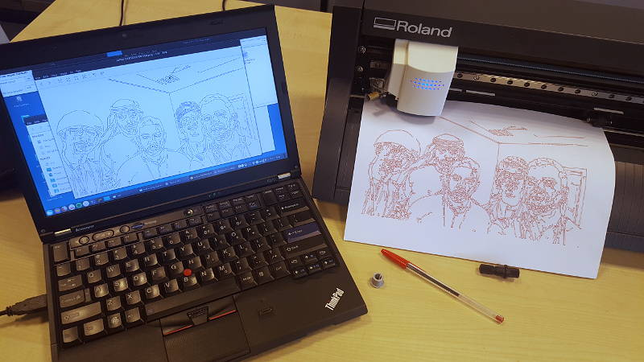

# Selfiebot

This is a modified version of the [original selfiebot project](https://github.com/nodebox/selfiebot). Selfiebot is a drawing robot that draws quick selfie images. This is a Processing sketch that converts the images to [Roland CAMM-GL III](./pnc900_user.pdf) using a canny edge detection. See some examples in the `Samples` folder.

## Modifications

At the moment the scrip writes a `.png` image for using it with fab modules and it writes directly a `.camm` file for the Roland Vinyl Cutters.

## Roland GS-24 specs

- Cut speed 10-500 mm/s
- Pen force 30-350 g
- Mechanical resolution 0.0125 mm/step that is 80 steps/mm
- Software resolution 0.0250 mm/step that is 40 steps/mm
- Instruction system CAMM-GL III
- Power DC 24 V, 2.8 A, 30W (for mobile labs)

## Roland CAMM-GL III file format

Trying to derive from [inkcut project](https://github.com/codelv/inkcut)

## Usage

1. Download [Processing](http://processing.org/download/).
2. Download and install the [controlP5 library](http://www.sojamo.de/libraries/controlP5/) and the video library.
3. Open the sketch and run it.
4. Stand in front of the webcam.
5. Press `i` to export the current image to a `.png`. Press `r` to export the current image to a `.camm` Roland file.  Press `g` to export the current image to a `.ngc` Gcode file.
6. Load the Roland Vinyl Cutter with a piece of paper and replace the blade with the [penholder adapter](https://github.com/TheBeachLab/Roland_VinylDraw) and your favourite bic pen, pencil or marker.
7. Option 1. Import the `.png` file into Fab Modules and proceed as if you were cutting vinyl. Option 2: Send the `.camm` file to the vinyl cutter `lpr -P vinyl -l file.camm`

## TODO

* Send file to roland `lpr -P vinyl -l fabricated.camm`
* Check that is allright or fix
* In big paper, mark origin and send file
* Modify paper size and resend
* Fix units (it seems that 40 machine units equals 1 mm being the origin at the lower left corner)
* Send via processing

## Credits

* Original sketch by [TODO](http://www.todo.to.it/)
* [Canny edge detection](http://www.tomgibara.com/computer-vision/canny-edge-detector) algoritm by Tom Gibara.
* Selfiebot uses a [Makelangelo Kit](https://github.com/MarginallyClever/Makelangelo)
* CAMM-GL III port by [Francisco Sanchez](http://beachlab.org)

## License
Selfiebot is released under the [Creative Commons Attribution-NonCommercial-ShareAlike 3.0 license](http://creativecommons.org/licenses/by-nc-sa/3.0/).
